# Entity Relationship Diagram (ERD)
Sistem: Website Informasi Publik STEI ITB

Berikut ini adalah rancangan Entity Relationship Diagram (ERD) lengkap berdasarkan struktur tabel pada file `migrations.md`. Diagram ini menampilkan kardinalitas relasi, kunci utama (Primary Key - PK), kunci asing (Foreign Key - FK), kunci unik (Unique Key - UK), serta tipe data dari masing-masing kolom.

## Diagram Relasi Entitas

```mermaid
erDiagram
    users ||--o{ pages : "menulis (author_id)"
    users ||--o{ news : "membuat (author_id)"
    users ||--o{ announcements : "menerbitkan (author_id)"
    study_programs ||--o{ lecturers : "memiliki dosen (study_program_id)"
    research_groups ||--o{ lecturers : "beranggotakan dosen (research_group_id)"
    research_groups ||--o{ researches : "memiliki penelitian (research_group_id)"
    researches ||--|{ lecturer_research : "ditulis oleh (research_id)"
    lecturers ||--|{ lecturer_research : "menulis (lecturer_id)"

    users {
        bigint id PK
        string name
        string email UK
        string password
        enum role
        string remember_token
        timestamp created_at
        timestamp updated_at
        timestamp deleted_at
    }

    study_programs {
        bigint id PK
        string name
        enum degree_level
        text description
        text curriculum_details
        text learning_outcomes
        string accreditation
        string degree_title
        string study_duration
        text career_prospects
        string contact_info
        timestamp created_at
        timestamp updated_at
        timestamp deleted_at
    }

    research_groups {
        bigint id PK
        string name
        text description
        timestamp created_at
        timestamp updated_at
        timestamp deleted_at
    }

    pages {
        bigint id PK
        string title
        string slug UK
        longText content
        string image
        enum status
        bigint author_id FK
        timestamp published_at
        timestamp created_at
        timestamp updated_at
        timestamp deleted_at
    }

    admissions {
        bigint id PK
        string selection_path
        enum degree_level
        text admission_requirements
        date start_date
        date end_date
        decimal tuition_fee
        integer capacity
        string external_link
        json faq
        string contact_info
        enum status
        timestamp created_at
        timestamp updated_at
        timestamp deleted_at
    }

    lecturers {
        bigint id PK
        string name
        string nip UK
        string nidn UK
        string functional_position
        bigint study_program_id FK
        bigint research_group_id FK
        string research_fields
        string email UK
        string photo
        string scopus_link
        string google_scholar_link
        string sinta_link
        string lab_managed
        enum status
        timestamp created_at
        timestamp updated_at
        timestamp deleted_at
    }

    researches {
        bigint id PK
        string title
        text abstract
        year year
        enum type
        string document_link
        string funding_source
        enum status
        bigint research_group_id FK
        timestamp created_at
        timestamp updated_at
        timestamp deleted_at
    }

    lecturer_research {
        bigint research_id PK,FK
        bigint lecturer_id PK,FK
        boolean is_primary_author
    }

    partnerships {
        bigint id PK
        string partner_name
        enum partnership_type
        date start_date
        date end_date
        text description
        string contact_info
        string logo
        string document_file
        enum status
        timestamp created_at
        timestamp updated_at
        timestamp deleted_at
    }

    news {
        bigint id PK
        string title
        string slug UK
        longText content
        string image
        enum category
        string tags
        bigint author_id FK
        enum status
        timestamp published_at
        integer views_count
        timestamp created_at
        timestamp updated_at
        timestamp deleted_at
    }

    events {
        bigint id PK
        string name
        string slug UK
        enum type
        dateTime start_datetime
        dateTime end_datetime
        string location
        text description
        string registration_link
        string speakers
        string organizer
        string poster
        enum status
        timestamp created_at
        timestamp updated_at
        timestamp deleted_at
    }

    announcements {
        bigint id PK
        string title
        string slug UK
        text content
        enum target_audience
        dateTime valid_from
        dateTime valid_until
        string attachment_file
        enum priority
        enum status
        boolean is_pinned
        bigint author_id FK
        timestamp created_at
        timestamp updated_at
        timestamp deleted_at
    }

    services {
        bigint id PK
        string name
        enum category
        text description
        text procedure
        string related_link
        string pic_contact
        string document_file
        enum status
        timestamp created_at
        timestamp updated_at
        timestamp deleted_at
    }

    visitors {
        bigint id PK
        string ip_address
        string user_agent
        string page_url
        timestamp visited_at
        timestamp created_at
    }

    search_logs {
        bigint id PK
        string keyword
        integer results_count
        timestamp searched_at
        timestamp created_at
    }
```

## Penjelasan Relasi & Foreign Key

1. **`users` 1:N `pages`**
   - Kolom: `pages.author_id` -> `users.id`
   - Keterangan: Satu administrator atau pembuat konten (`users`) dapat membuat/menulis banyak halaman (`pages`), sedangkan satu halaman ditulis oleh satu pengguna.

2. **`users` 1:N `news`**
   - Kolom: `news.author_id` -> `users.id`
   - Keterangan: Satu pengguna (`users`) dapat membuat banyak berita (`news`), sedangkan satu berita diterbitkan oleh satu pengguna.

3. **`users` 1:N `announcements`**
   - Kolom: `announcements.author_id` -> `users.id`
   - Keterangan: Satu pengguna (`users`) dapat menerbitkan banyak pengumuman (`announcements`).

4. **`study_programs` 1:N `lecturers`**
   - Kolom: `lecturers.study_program_id` -> `study_programs.id`
   - Keterangan: Satu program studi (`study_programs`) memiliki banyak dosen pengajar (`lecturers`), namun setiap dosen secara administratif menginduk pada satu program studi.

5. **`research_groups` 1:N `lecturers`**
   - Kolom: `lecturers.research_group_id` -> `research_groups.id`
   - Keterangan: Satu kelompok keahlian (`research_groups`) beranggotakan banyak dosen (`lecturers`).

6. **`research_groups` 1:N `researches`**
   - Kolom: `researches.research_group_id` -> `research_groups.id`
   - Keterangan: Satu kelompok keahlian (`research_groups`) memiliki banyak publikasi dan proyek penelitian (`researches`).

7. **`researches` N:M `lecturers` (melalui tabel pivot `lecturer_research`)**
   - Kolom Pivot: `lecturer_research.research_id` -> `researches.id`
   - Kolom Pivot: `lecturer_research.lecturer_id` -> `lecturers.id`
   - Keterangan: Satu dosen dapat memiliki banyak penelitian/publikasi, dan satu publikasi bisa ditulis oleh beberapa dosen secara kolaboratif. Relasi *Many-to-Many* ini dipecahkan oleh tabel pivot `lecturer_research`.
