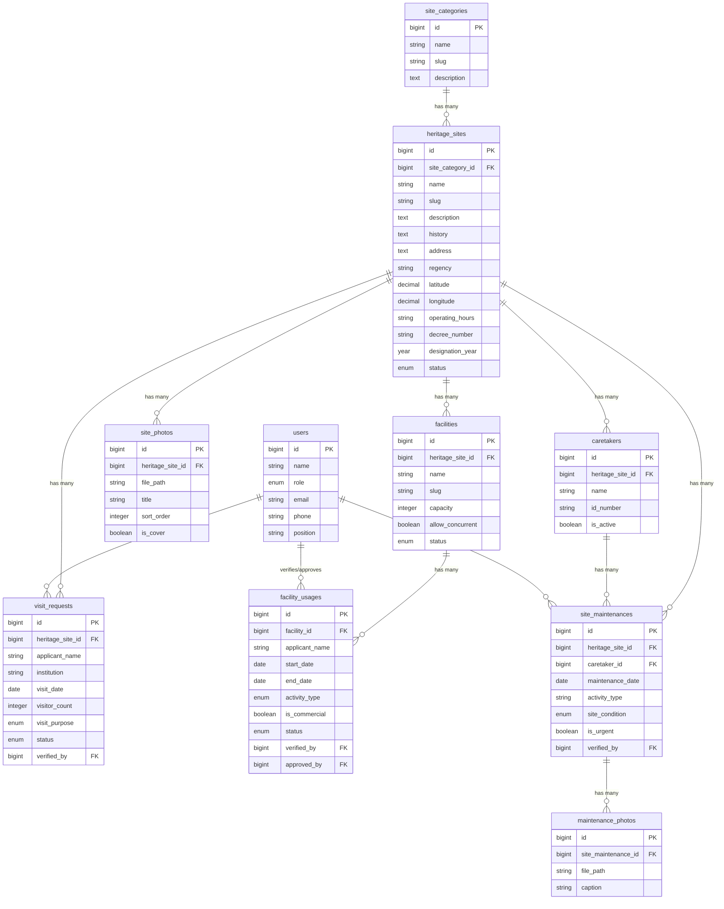

# Database Migration Context
## Sistem Informasi Layanan Publik Kebudayaan — Balai Pelestarian Kebudayaan DI Yogyakarta

> Dokumen ini mendefinisikan seluruh tabel database yang perlu dibuat melalui Laravel migration.
> Penamaan tabel mengikuti konvensi Laravel: **bahasa Inggris, snake_case, plural**.

---

## Pemetaan Entitas → Tabel

| Entitas (Bahasa Indonesia) | Tabel (Laravel) | Model |
|---|---|---|
| Pengguna (dengan peran) | `users` (modifikasi) | `User` |
| Kategori Situs | `site_categories` | `SiteCategory` |
| Situs Cagar Budaya | `heritage_sites` | `HeritageSite` |
| Foto Situs | `site_photos` | `SitePhoto` |
| Permohonan Kunjungan | `visit_requests` | `VisitRequest` |
| Fasilitas | `facilities` | `Facility` |
| Penggunaan Fasilitas | `facility_usages` | `FacilityUsage` |
| Juru Pelihara | `caretakers` | `Caretaker` |
| Pemeliharaan Situs | `site_maintenances` | `SiteMaintenance` |
| Foto Pemeliharaan | `maintenance_photos` | `MaintenancePhoto` |

---

## Urutan Migration

> Migration harus dijalankan dalam urutan ini karena adanya foreign key dependencies.

```
1. add_role_to_users_table          → modifikasi tabel users
2. create_site_categories_table     → master kategori (tidak ada FK)
3. create_heritage_sites_table      → FK → site_categories
4. create_site_photos_table         → FK → heritage_sites
5. create_visit_requests_table      → FK → heritage_sites, users
6. create_facilities_table          → FK → heritage_sites
7. create_facility_usages_table     → FK → facilities, users
8. create_caretakers_table          → FK → heritage_sites
9. create_site_maintenances_table   → FK → heritage_sites, caretakers, users
10. create_maintenance_photos_table → FK → site_maintenances
```

---

## 1. Modifikasi Tabel `users`

**Migration:** `add_role_to_users_table`

Menambahkan kolom ke tabel `users` yang sudah ada.

| Kolom | Tipe | Constraint | Keterangan |
|-------|------|------------|------------|
| `role` | `enum('admin','operator','pimpinan')` | default `'operator'`, after `name` | Peran pengguna dalam sistem |
| `phone` | `string(20)` | nullable, after `email` | Nomor telepon |
| `position` | `string` | nullable, after `phone` | Jabatan |

---

## 2. Tabel `site_categories`

**Migration:** `create_site_categories_table`
**Deskripsi:** Master data kategori situs cagar budaya.

| Kolom | Tipe | Constraint | Keterangan |
|-------|------|------------|------------|
| `id` | `bigIncrements` | PK | |
| `name` | `string` | required | Nama kategori |
| `slug` | `string` | unique | URL-friendly identifier |
| `description` | `text` | nullable | Deskripsi kategori |
| `timestamps` | | | `created_at`, `updated_at` |

**Nilai awal (seeder):**
- Candi
- Situs Budaya
- Tempat Bersejarah
- Pendopo
- Bangunan Bersejarah
- Kawasan Cagar Budaya

---

## 3. Tabel `heritage_sites`

**Migration:** `create_heritage_sites_table`
**Deskripsi:** Data utama situs/lokasi cagar budaya.

| Kolom | Tipe | Constraint | Keterangan |
|-------|------|------------|------------|
| `id` | `bigIncrements` | PK | |
| `site_category_id` | `foreignId` | FK → `site_categories.id`, cascadeOnDelete | Kategori situs |
| `name` | `string` | required | Nama situs |
| `slug` | `string` | unique | URL-friendly identifier |
| `description` | `text` | nullable | Deskripsi lengkap |
| `history` | `text` | nullable | Sejarah singkat |
| `address` | `text` | required | Alamat lengkap |
| `regency` | `string` | required | Kabupaten/Kota |
| `district` | `string` | nullable | Kecamatan |
| `village` | `string` | nullable | Kelurahan/Desa |
| `latitude` | `decimal(10,7)` | required | Koordinat GPS latitude |
| `longitude` | `decimal(10,7)` | required | Koordinat GPS longitude |
| `operating_hours` | `string` | nullable | Jam operasional (misal: "08:00 - 17:00") |
| `contact` | `string` | nullable | Nomor telepon/email pengelola |
| `decree_number` | `string` | nullable | Nomor SK penetapan cagar budaya |
| `designation_year` | `year` | nullable | Tahun penetapan |
| `status` | `enum('active','inactive')` | default `'active'` | Status tampil di halaman publik |
| `timestamps` | | | `created_at`, `updated_at` |

**Aturan bisnis yang menjadi validasi:**
- Wajib diisi: `name`, `site_category_id`, `address`, `latitude`, `longitude`
- Status `inactive` → tidak tampil di halaman publik, tetap tersimpan di database

---

## 4. Tabel `site_photos`

**Migration:** `create_site_photos_table`
**Deskripsi:** Galeri foto untuk setiap situs cagar budaya.

| Kolom | Tipe | Constraint | Keterangan |
|-------|------|------------|------------|
| `id` | `bigIncrements` | PK | |
| `heritage_site_id` | `foreignId` | FK → `heritage_sites.id`, cascadeOnDelete | Situs pemilik foto |
| `file_path` | `string` | required | Path file foto |
| `title` | `string` | nullable | Judul/caption foto |
| `description` | `text` | nullable | Keterangan tambahan |
| `sort_order` | `integer` | default `0` | Urutan tampil di galeri |
| `is_cover` | `boolean` | default `false` | Penanda foto utama/cover |
| `timestamps` | | | `created_at`, `updated_at` |

---

## 5. Tabel `visit_requests`

**Migration:** `create_visit_requests_table`
**Deskripsi:** Permohonan kunjungan resmi ke situs cagar budaya.

| Kolom | Tipe | Constraint | Keterangan |
|-------|------|------------|------------|
| `id` | `bigIncrements` | PK | |
| `heritage_site_id` | `foreignId` | FK → `heritage_sites.id`, cascadeOnDelete | Situs tujuan kunjungan |
| `applicant_name` | `string` | required | Nama pemohon |
| `institution` | `string` | nullable | Asal instansi/lembaga |
| `phone` | `string(20)` | required | Nomor telepon |
| `email` | `string` | nullable | Email pemohon |
| `visit_date` | `date` | required | Tanggal kunjungan yang diminta |
| `visitor_count` | `unsignedInteger` | required | Jumlah pengunjung (max 100) |
| `visit_purpose` | `enum('tourism','education','research','other')` | default `'tourism'` | Tujuan kunjungan |
| `purpose_description` | `text` | nullable | Penjelasan tambahan tujuan |
| `application_letter` | `string` | nullable | File path surat permohonan |
| `recommendation_letter` | `string` | nullable | File surat rekomendasi (wajib jika research) |
| `status` | `enum('submitted','verified','approved','rejected','completed')` | default `'submitted'` | Status permohonan |
| `verification_notes` | `text` | nullable | Catatan dari operator |
| `rejection_reason` | `text` | nullable | Alasan penolakan |
| `actual_visitor_count` | `unsignedInteger` | nullable | Realisasi jumlah pengunjung |
| `verified_by` | `foreignId` | nullable, FK → `users.id`, nullOnDelete | Operator yang memverifikasi |
| `verified_at` | `timestamp` | nullable | Waktu verifikasi |
| `timestamps` | | | `created_at`, `updated_at` |

**Alur status:**
```
submitted → verified → approved → completed
                    ↘ rejected
```

**Aturan bisnis yang menjadi validasi:**
- `visit_date` minimal H-3 dari tanggal pengajuan
- `visitor_count` maksimal 100
- Jika `visit_purpose` = `research`, maka `recommendation_letter` wajib diisi
- Maksimal 3 rombongan per situs per tanggal yang sama (validasi di level aplikasi)

---

## 6. Tabel `facilities`

**Migration:** `create_facilities_table`
**Deskripsi:** Master data fasilitas yang tersedia di lingkungan cagar budaya.

| Kolom | Tipe | Constraint | Keterangan |
|-------|------|------------|------------|
| `id` | `bigIncrements` | PK | |
| `heritage_site_id` | `foreignId` | FK → `heritage_sites.id`, cascadeOnDelete | Situs tempat fasilitas berada |
| `name` | `string` | required | Nama fasilitas (Pendopo Agung, Halaman Candi, dll.) |
| `slug` | `string` | unique | URL-friendly identifier |
| `description` | `text` | nullable | Deskripsi fasilitas |
| `capacity` | `unsignedInteger` | nullable | Kapasitas maksimal orang |
| `allow_concurrent` | `boolean` | default `false` | Boleh digunakan bersamaan? |
| `photo` | `string` | nullable | Foto fasilitas |
| `status` | `enum('available','unavailable','maintenance')` | default `'available'` | Status ketersediaan |
| `timestamps` | | | `created_at`, `updated_at` |

---

## 7. Tabel `facility_usages`

**Migration:** `create_facility_usages_table`
**Deskripsi:** Permohonan penggunaan fasilitas cagar budaya.

| Kolom | Tipe | Constraint | Keterangan |
|-------|------|------------|------------|
| `id` | `bigIncrements` | PK | |
| `facility_id` | `foreignId` | FK → `facilities.id`, cascadeOnDelete | Fasilitas yang dimohon |
| `applicant_name` | `string` | required | Nama pemohon |
| `institution` | `string` | nullable | Instansi/lembaga |
| `phone` | `string(20)` | required | Nomor telepon |
| `email` | `string` | nullable | Email pemohon |
| `start_date` | `date` | required | Tanggal mulai penggunaan |
| `end_date` | `date` | required | Tanggal selesai penggunaan |
| `duration` | `string` | nullable | Keterangan durasi |
| `activity_type` | `enum('traditional_ceremony','cultural_performance','education','exhibition','social_religious','other')` | required | Jenis kegiatan |
| `is_commercial` | `boolean` | default `false` | Kegiatan komersial (perlu persetujuan tambahan) |
| `activity_description` | `text` | nullable | Deskripsi kegiatan |
| `participant_count` | `unsignedInteger` | nullable | Jumlah peserta kegiatan |
| `application_letter` | `string` | nullable | File surat permohonan resmi |
| `activity_proposal` | `string` | nullable | File proposal kegiatan |
| `status` | `enum('submitted','verified','pending_approval','approved','rejected','completed')` | default `'submitted'` | Status permohonan |
| `verification_notes` | `text` | nullable | Catatan dari operator |
| `approval_notes` | `text` | nullable | Catatan dari pimpinan |
| `rejection_reason` | `text` | nullable | Alasan penolakan |
| `post_usage_condition` | `text` | nullable | Kondisi fasilitas pasca-penggunaan |
| `verified_by` | `foreignId` | nullable, FK → `users.id`, nullOnDelete | Operator yang memverifikasi |
| `verified_at` | `timestamp` | nullable | Waktu verifikasi |
| `approved_by` | `foreignId` | nullable, FK → `users.id`, nullOnDelete | Pimpinan yang menyetujui |
| `approved_at` | `timestamp` | nullable | Waktu persetujuan |
| `timestamps` | | | `created_at`, `updated_at` |

**Alur status:**
```
submitted → verified → pending_approval → approved → completed
                                       ↘ rejected
```

**Aturan bisnis yang menjadi validasi:**
- `start_date` minimal H-7 dari tanggal pengajuan
- `end_date` ≥ `start_date`
- Fasilitas dengan `allow_concurrent = false` tidak boleh double-book pada tanggal yang sama
- Jika `is_commercial = true`, status harus melewati `pending_approval`
- Jenis kegiatan yang diperbolehkan sesuai enum `activity_type`

---

## 8. Tabel `caretakers`

**Migration:** `create_caretakers_table`
**Deskripsi:** Data juru pelihara (juru kunci) situs cagar budaya.

| Kolom | Tipe | Constraint | Keterangan |
|-------|------|------------|------------|
| `id` | `bigIncrements` | PK | |
| `heritage_site_id` | `foreignId` | FK → `heritage_sites.id`, cascadeOnDelete | Situs yang dipelihara |
| `name` | `string` | required | Nama juru pelihara |
| `id_number` | `string(30)` | nullable | NIP atau NIK |
| `phone` | `string(20)` | nullable | Nomor telepon |
| `email` | `string` | nullable | Email |
| `address` | `text` | nullable | Alamat tempat tinggal |
| `photo` | `string` | nullable | Foto juru pelihara |
| `is_active` | `boolean` | default `true` | Status aktif |
| `timestamps` | | | `created_at`, `updated_at` |

**Aturan bisnis:**
- Setiap `heritage_site` wajib memiliki minimal 1 caretaker aktif

---

## 9. Tabel `site_maintenances`

**Migration:** `create_site_maintenances_table`
**Deskripsi:** Log kegiatan pemeliharaan situs cagar budaya.

| Kolom | Tipe | Constraint | Keterangan |
|-------|------|------------|------------|
| `id` | `bigIncrements` | PK | |
| `heritage_site_id` | `foreignId` | FK → `heritage_sites.id`, cascadeOnDelete | Situs yang dipelihara |
| `caretaker_id` | `foreignId` | FK → `caretakers.id`, cascadeOnDelete | Juru pelihara pelaksana |
| `maintenance_date` | `date` | required | Tanggal pemeliharaan |
| `activity_type` | `string` | required | Jenis kegiatan (pembersihan, perawatan, perbaikan, dll.) |
| `description` | `text` | required | Deskripsi kegiatan pemeliharaan |
| `site_condition` | `enum('good','minor_damage','major_damage')` | default `'good'` | Kondisi situs saat ini |
| `follow_up` | `text` | nullable | Tindak lanjut yang diperlukan |
| `is_urgent` | `boolean` | default `false` | Kerusakan berat = urgent |
| `verified_by` | `foreignId` | nullable, FK → `users.id`, nullOnDelete | Operator yang memverifikasi |
| `verified_at` | `timestamp` | nullable | Waktu verifikasi |
| `timestamps` | | | `created_at`, `updated_at` |

**Aturan bisnis:**
- Laporan pemeliharaan rutin wajib minimal 1× per bulan per situs
- Jika `site_condition` = `major_damage`, otomatis `is_urgent = true`, harus dilaporkan dalam 1×24 jam

---

## 10. Tabel `maintenance_photos`

**Migration:** `create_maintenance_photos_table`
**Deskripsi:** Foto dokumentasi kegiatan pemeliharaan.

| Kolom | Tipe | Constraint | Keterangan |
|-------|------|------------|------------|
| `id` | `bigIncrements` | PK | |
| `site_maintenance_id` | `foreignId` | FK → `site_maintenances.id`, cascadeOnDelete | Kegiatan pemeliharaan terkait |
| `file_path` | `string` | required | Path file foto |
| `caption` | `string` | nullable | Keterangan foto |
| `timestamps` | | | `created_at`, `updated_at` |

---

## Entity Relationship Diagram



---

## Catatan Konvensi Laravel

- **Nama tabel**: plural, snake_case, bahasa Inggris (`heritage_sites`, bukan `situs_cagar_budaya`)
- **Nama model**: singular, PascalCase (`HeritageSite`)
- **Foreign key**: `{singular_table_name}_id` (misal: `heritage_site_id`)
- **Timestamps**: semua tabel menggunakan `$table->timestamps()`
- **Soft deletes**: tidak digunakan kecuali diminta nanti
- **Enum values**: lowercase, snake_case, bahasa Inggris
- **File upload**: disimpan sebagai `string` (path relatif ke `storage/app/public`)
